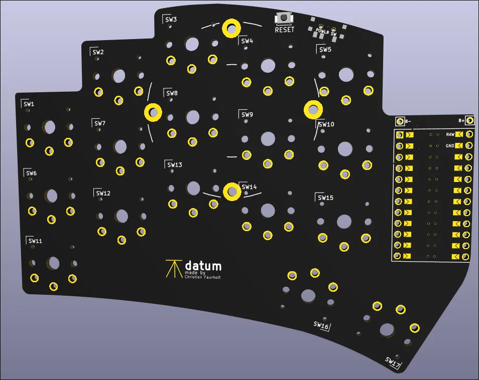
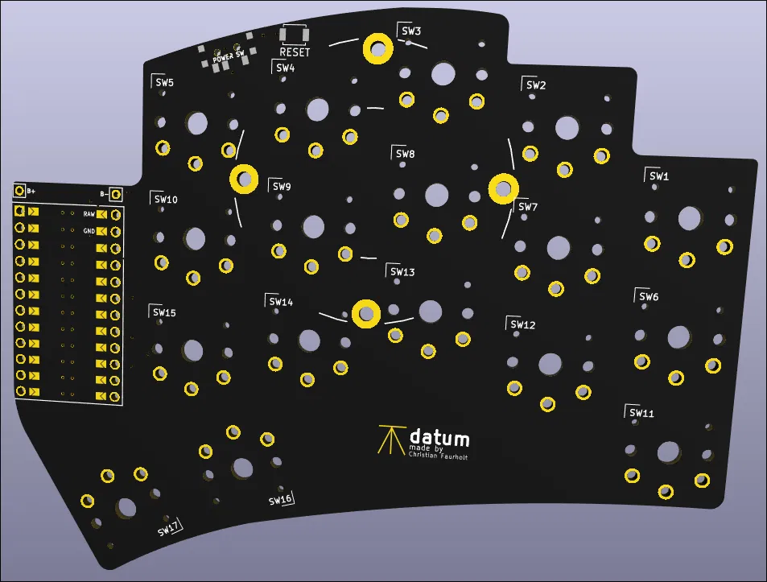

# datum

A low-profile wireless split keyboard. Fixed reference point for the Hermatic stack.

**made by Christian Faurholt**

---

<p align="center">
  
  
</p>

---

## What it is

datum is a 34-key wireless split keyboard based on the Ferris Sweep Half Swept layout, built around a Nice!nano V2 and ZMK firmware. It runs the Gallium columnar stagger layout — an alternative to QWERTY optimised specifically for columnar stagger boards and Rust development.

The name comes from surveying. A datum is the fixed reference point from which all other measurements are derived. The benchmark symbol carved into the PCB is the ordnance survey mark used for exactly this purpose — a point cut into stone at a precisely known elevation, against which everything else is measured.

datum is the physical interface to Hermatic. The one fixed, trusted point where the Hermatician touches the system.

---

## Specifications

| Property | Value |
|---|---|
| Layout | 34 keys — 3×5 column stagger + 2 thumb keys per half |
| Controller | Nice!nano V2 (nRF52840, wireless BLE) |
| Firmware | ZMK — Gallium columnar stagger layout |
| Switches | Ambients Silent Bokeh Choc v1, 50gf |
| Keycaps | MBK Black 1U, Choc spacing 18×17mm |
| PCB | datum — reversible, black soldermask, ENIG finish |
| Build style | Bare PCB, no case, soldered direct |
| Tenting | Splitkb Tenting Puck + Manfrotto Pocket Tripod per half |
| Battery | LiPo 301230 110mAh soldered direct to BAT+/BAT- pads |
| Connection | Wireless BLE only — no TRRS, no USB data in normal use |

---

## Components

### PCB

Order from PCBWay using the gerbers in `gerbers/datum_gerbers.zip`:

| Setting | Value |
|---|---|
| Quantity | 10 (minimum order — use 4, keep 6 as spares) |
| Layers | 2 |
| Thickness | 1.6mm |
| Soldermask | Black (Matte) |
| Silkscreen | White |
| Surface finish | Immersion gold (ENIG) |
| Copper weight | 1oz |

### Electronics

| Item | Qty | Source |
|---|---|---|
| Nice!nano V2 | ×4 | Typeractive.xyz |
| Mill-Max Low Profile Sockets 310 series | ×4 sets | Splitkb.com |
| Reset Button — Panasonic SMD | ×4 | Typeractive.xyz |
| Power Switch — Alps SPDT | ×4 | Typeractive.xyz |
| LiPo 301230 110mAh 3.7V | ×4 | — |

### Switches and keycaps

| Item | Qty | Source |
|---|---|---|
| Ambients Silent Bokeh Choc v1 50gf | ×70 | lowprokb.ca |
| MBK Black 1U keycaps | ×70 | lowprokb.ca |
| MBK Black 1U homing keycaps | ×4 | lowprokb.ca |

### Mounting

| Item | Qty | Source |
|---|---|---|
| Splitkb Tenting Puck — Black | ×2 pairs | Splitkb.com |
| Manfrotto Pocket Tripod | ×4 | — |
| SKUF Silicone Rubber Feet | ×16 | Splitkb.com |

---

## Firmware

datum uses ZMK firmware with the Gallium columnar stagger layout, home row mods, and Rust-optimised combos (`::`, `->`, `=>`).

Firmware is built automatically via GitHub Actions. Download the latest build from the [Actions tab](../../actions) — no local toolchain needed.

See [`docs/firmware-guide.md`](docs/firmware-guide.md) for the full layer design, home row mod setup, and flashing instructions.

---

## Building

See [`docs/build-guide.md`](docs/build-guide.md) for full assembly instructions.

Critical notes before you start:

- The PCB is reversible — close the correct jumper pads before soldering anything else
- Battery polarity is critical — reversed polarity will instantly damage the Nice!nano
- Never solder the Nice!nano directly — always use Mill-Max sockets

---

## Repository layout

```
datum/
├── pcb/                  # KiCad project files
├── gerbers/              # Fabrication files for PCBWay
├── config/               # ZMK firmware config
│   ├── cradio.keymap     # Gallium layout, layers, combos
│   ├── cradio.conf       # ZMK settings
│   └── west.yml          # ZMK dependency
├── build.yaml            # GitHub Actions build matrix
├── docs/
│   ├── build-guide.md    # Assembly instructions
│   ├── build-guide.pdf
│   ├── firmware-guide.md # ZMK setup, layers, Gallium
│   ├── firmware-guide.pdf
│   └── images/           # 3D renders
└── README.md
```

---

## License

MIT
